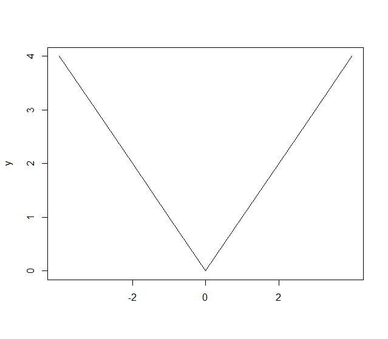
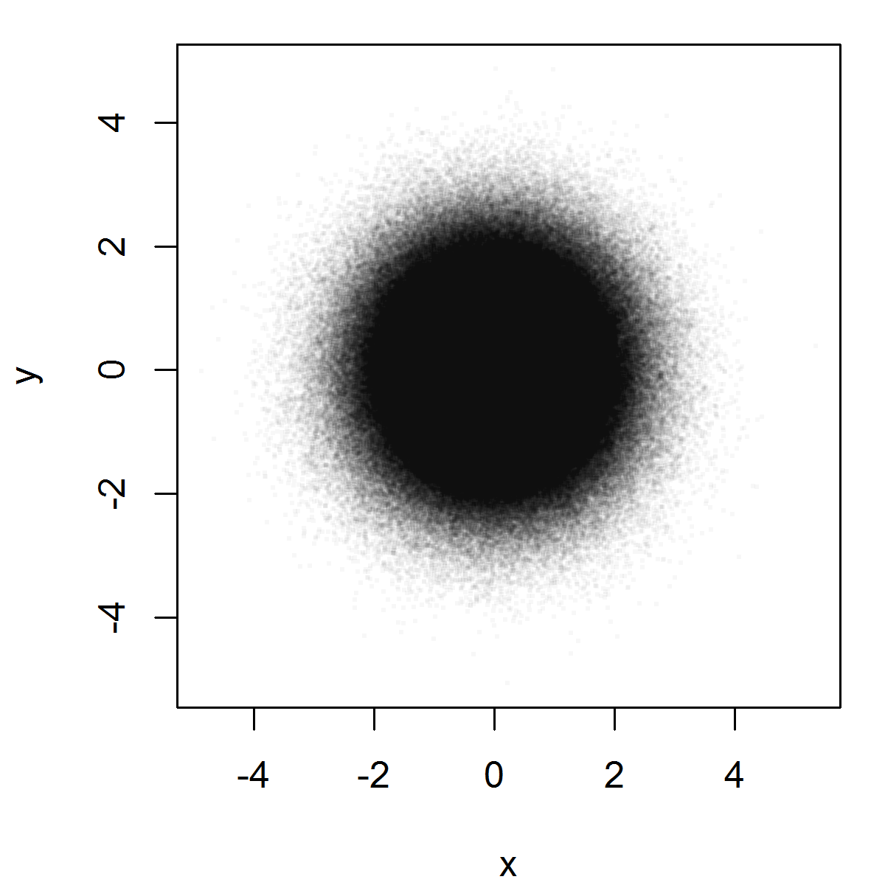

Graphics
=====================

Strip Chart
--------------

Over Plot Method
'''''''''''''''''

Jitter Method
'''''''''''''''''

Stack Method
'''''''''''''''

Stem and Leaf Plots
-----------------------------

.. index:: stem and leaf plot, stem()

These are completely textual plots. A numeric vector is plotted as follows.
From each number, the first and last digits are taken. First digit
becomes the stem, last digit becomes the left.  Stems go to
the left of | and leaves go to the right of |. 

::
	> stem(c(10, 11, 21, 22, 23, 24, 25, 30, 31, 41,42,43,44,45,46,47, 60, 70))

	  The decimal point is 1 digit(s) to the right of the |

	  0 | 01
	  2 | 1234501
	  4 | 1234567
	  6 | 00

Scale parameter can be used to expand the plot::

	> stem(c(10, 11, 21, 22, 23, 24, 25, 30, 31, 41,42,43,44,45,46,47, 60, 70), scale=2)

	  The decimal point is 1 digit(s) to the right of the |

	  1 | 01
	  2 | 12345
	  3 | 01
	  4 | 1234567
	  5 | 
	  6 | 0
	  7 | 0

Histograms
--------------------------------

.. index:: hist

Plotting a histogram::

	hist(rnorm(100))
	hist(rnorm(100), col="red")

Index Plot
----------------------

Spikes
''''''''''''''

Points
''''''''''''''''''

Simple Charts
----------------------------

.. index:: plot()

Line Charts
''''''''''''''''''''

A line chart::

	x = rnorm(10); plot(x, type="l", col="blue")

Plot function
--------------------------------

.. rubric:: Controlling the labels on x-axis

Let's prepare some data::

	> x <- -4:4
	> y <- abs(x)

Let's plot the ``y`` data without any labels on x-axis::

	> plot(y, type='l', xaxt='n', xlab='')

Let's specify labels for specific values of ``y``::

	> axis(1, at=which(y==0), labels=c(0))
	> axis(1, at=which(y==2), labels=c(-2,2))

Exporting Plots
-------------------------------

.. index:: png, exporting; plot

Some data to be plotted::

	x <- rnorm(1000000)
	y <- rnorm(1000000)

Preparing a PNG device attached to a file for plotting::

	png("plot_export_demo.png", width=4, height=4, units="in", res=300)
	par(mar=c(4,4,1,1))

Plotting the data::

	plot(x,y,col=rgb(0,0,0,0.03), pch=".", cex=2)

Closing the device to finish the export::

	dev.off()

Adding a Rug to a Plot
-------------------------------

Bar Charts
--------------------------------

Pie Charts
--------------------------------

Scatter Plots
--------------------------------

Heat Maps
--------------------------------

Box Plots
-----------------------------

QQ Plots
-----------------------------

