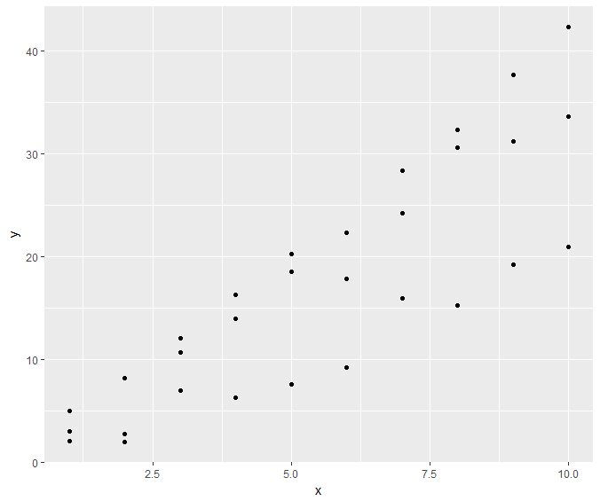
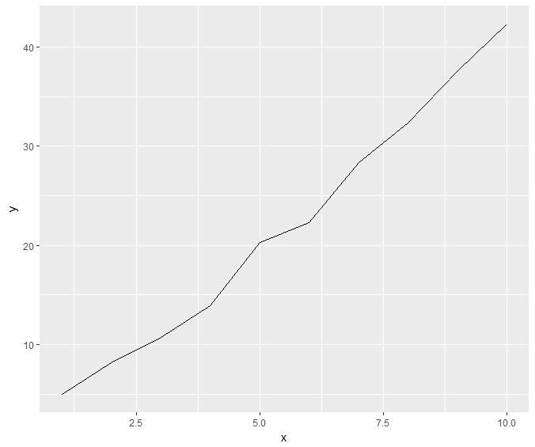
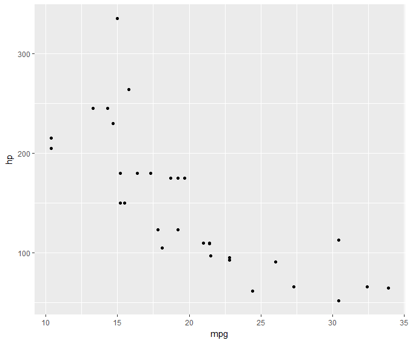
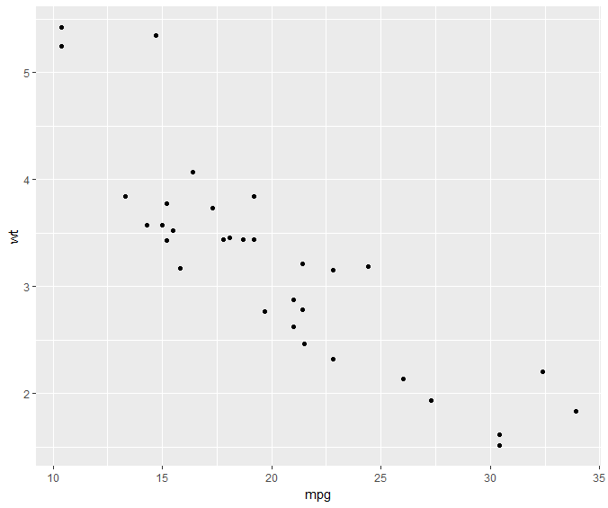

GGPlot2
===================

The grammar of graphics has following ideas:

* data set
* coordinate systems
* scales
* geometrical objects (points, lines, boxes, bars, etc.)
* aesthetics (size, color, transparency, etc.)
* facets

List of aesthetics

.. list-table::
    :header-rows: 1

    * - Aesthetic
      - Description
      - Details
    * - color
      - color of points
      - 
    * - size
      - size of points
      -
    * - shape
      - shape of points
      - 6 shapes by default
    * - fill 
      - fill color for bars, etc.
      -
    * - alpha 
      - transparency
      - 0 - totally transparent, 1 - totally opaque
    * - stroke
      -
      -
    * - linetype
      -
      -

We will prepare a data set consisting of points
from three noisy lines::

    > x <- c(1:10)
    > y1 <- 4 * x + 2*rnorm(10)
    > y2 <- 3.5 * x + 2*rnorm(10)
    > y3 <- 2 * x + 2*rnorm(10)
    > y <- c(y1, y2, y3)
    > x <- rep(x, 3)
    > index <- rep(1:3, each=10)
    > df <- data.frame(index=index, x=x, y=y)
    > df
       index  x         y
    1      1  1  4.970771
    2      1  2  8.178185
    3      1  3 10.698853
    4      1  4 13.931963
    5      1  5 20.264946
    6      1  6 22.301773
    7      1  7 28.370019
    8      1  8 32.313593
    9      1  9 37.628974
    10     1 10 42.292327
    11     2  1  3.052891
    12     2  2  2.792227
    13     2  3 12.092148
    14     2  4 16.325021
    15     2  5 18.509915
    16     2  6 17.871619
    17     2  7 24.220242
    18     2  8 30.617569
    19     2  9 31.180454
    20     2 10 33.617135
    21     3  1  2.024496
    22     3  2  1.985061
    23     3  3  6.995560
    24     3  4  6.292036
    25     3  5  7.542600
    26     3  6  9.227137
    27     3  7 15.913043
    28     3  8 15.263772
    29     3  9 19.253074
    30     3 10 20.927419

:: 

    > qplot(x, y, data=df)

Plotting data from line 1 as a line::

    > df[df$index==1, ]
       index  x         y
    1      1  1  4.970771
    2      1  2  8.178185
    3      1  3 10.698853
    4      1  4 13.931963
    5      1  5 20.264946
    6      1  6 22.301773
    7      1  7 28.370019
    8      1  8 32.313593
    9      1  9 37.628974
    > qplot(x, y, data=df[df$index == 1, ], geom='line')

::

    > qplot(mpg, hp, data=mtcars)

::
 
  > qplot(mpg, wt, data=mtcars)

..:: 

    .. image:: images/plt.png
    .. image:: images/plt.png
    .. image:: images/plt.png
    .. image:: images/plt.png
    .. image:: images/plt.png
    .. image:: images/plt.png
    .. image:: images/plt.png
    .. image:: images/plt.png
    .. image:: images/plt.png
    .. image:: images/plt.png
    .. image:: images/plt.png
    .. image:: images/plt.png
    .. image:: images/plt.png
    .. image:: images/plt.png
    .. image:: images/plt.png
    .. image:: images/plt.png
    .. image:: images/plt.png
    .. image:: images/plt.png
    .. image:: images/plt.png
    .. image:: images/plt.png
    .. image:: images/plt.png
    .. image:: images/plt.png
    .. image:: images/plt.png
    .. image:: images/plt.png
    .. image:: images/plt.png
    .. image:: images/plt.png
    .. image:: images/plt.png
    .. image:: images/plt.png
    .. image:: images/plt.png
