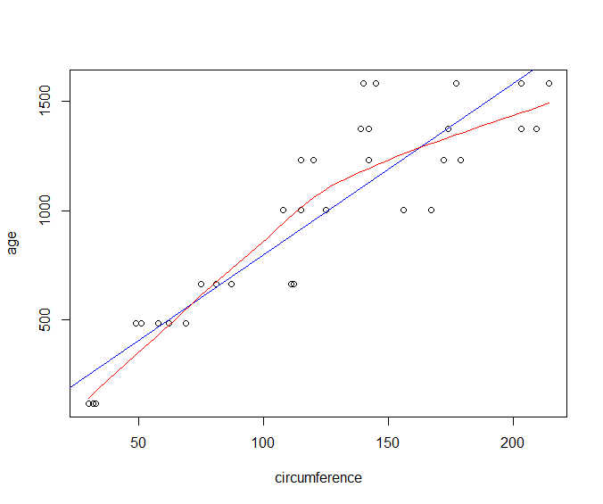
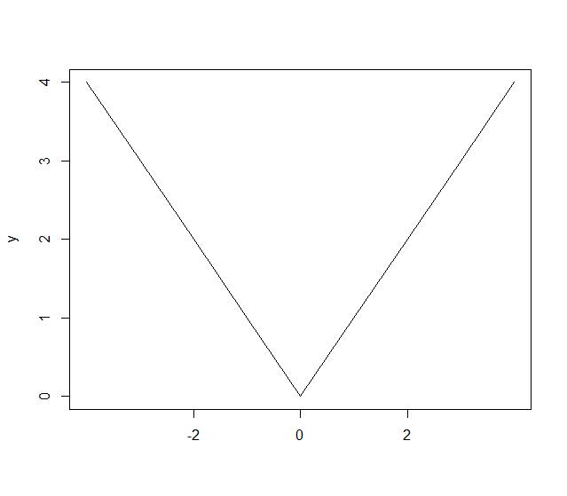

Simple Charts
=================

.. index:: charts

This section focuses on functionality provided by the graphics package. 

* We build a graph by one main command.
* We follow it by a sequence of auxiliary commands to add more elements to the graphics.

Plotting and charting functions support a set of commonly used parameters. 
They are listed here for quick reference. You will see them being used
in rest of the section.

.. list-table::
	:header-rows: 1

	* - Parameter
	  - Purpose
	* - xlab
	  - Label of X Axis
	* - ylab
	  - Label of Y Axis
	* - xlim
	  - Limits for the range of values in X Axis
	* - ylim
	  - Limits for the range of values in Y Axis
	* - main
	  - Main title for the plot

Strip Chart
--------------

.. index:: strip chart

.. rubric:: Over Plot Method

:: 

	> stripchart(precip, xlab='rain fall')

.. rubric:: Jitter Method

::

	> data <- sample(1:10, 20, replace=TRUE)
	> data
	 [1]  9  7 10  2  3  3  6  9  4  5  2  5 10  3  1  2  5  2  3  6
	> stripchart(data, method='jitter')
	> sort(data)
	 [1]  1  2  2  2  2  3  3  3  3  4  5  5  5  6  6  7  9  9 10 10

.. rubric:: Stack Method

::

	> stripchart(data, method='stack')

Histograms
--------------------------------

.. index:: hist

Plotting a histogram::

	hist(rnorm(100))
	hist(rnorm(100), col="red")

Stem and Leaf Plots
-----------------------------

.. index:: stem and leaf plot, stem()

These are completely textual plots. A numeric vector is plotted as follows.
From each number, the first and last digits are taken. First digit
becomes the stem, last digit becomes the left.  Stems go to
the left of | and leaves go to the right of |. 

::
	> stem(c(10, 11, 21, 22, 23, 24, 25, 30, 31, 41,42,43,44,45,46,47, 60, 70))

	  The decimal point is 1 digit(s) to the right of the |

	  0 | 01
	  2 | 1234501
	  4 | 1234567
	  6 | 00

Scale parameter can be used to expand the plot::

	> stem(c(10, 11, 21, 22, 23, 24, 25, 30, 31, 41,42,43,44,45,46,47, 60, 70), scale=2)

	  The decimal point is 1 digit(s) to the right of the |

	  1 | 01
	  2 | 12345
	  3 | 01
	  4 | 1234567
	  5 | 
	  6 | 0
	  7 | 0

Bar Charts
--------------------------------

Pie Charts
--------------------------------

Scatter Plots
--------------------------------

Plotting age vs circumference from the Orange dataset::

	> plot(age~circumference, data=Orange)

.. rubric:: Scatter Plot with Linear Model and Fitted Curve

We can overlay a linear model fit on top of our scatter plot.

Let us first create our scatter plot::

	> plot(age~circumference, data=Orange)

Let us now create a linear model between age and circumference and plot the fitted model:: 

	> abline(lm(age~circumference, dat=Orange), col='blue')

Finally, let us draw a smooth curve fitting the given data:: 

	> lines(loess.smooth(Orange$circumference, Orange$age), col='red')

Box Plots
-----------------------------

.. index:: boxplot, box plot

:: 

	> boxplot(mtcars$mpg)

	
.. image:: images/boxplot_mtcars_mpg.png

A box plot covers following statistics of the data:

* Lower and Upper hinges making up the box
* Median making up the line in the middle of the box
* Whiskers extending from the box up to the maximum and minimum values in the data

The outliers in data are identified and drawn separately as circles 
beyond the maximum and minimum values
[calculated after removing outliers].

* A longer whisker (in one direction) indicates skewness in that direction.

Plotting multiple variables from a data frame::

	> boxplot(iris)

.. rubric:: Outliers

* A *potential outlier* falls beyond 1.5 times the width of the box on either side.
* A *suspected outlier* falls beyond 3 times the width of the box on either side.
* Both are drawn as circle in the box plot in R.

.. index:: boxplot.stats, outliers;box plot

Finding the list of outliers::

	> boxplot.stats(precip)
	$stats
	   Phoenix  Milwaukee  Pittsburg Providence     Mobile 
	      11.5       29.1       36.6       42.8       59.8 

	$n
	[1] 70

	$conf
	[1] 34.01281 39.18719

	$out
	     Mobile     Phoenix        Reno Albuquerque     El Paso 
	       67.0         7.0         7.2         7.8         7.8 

The ``$out`` variable gives the list of outliers.

.. index:: suspected outliers

Finding the list of suspected outliers::

	> boxplot.stats(rivers, coef=3)$out
	[1] 2348 3710 2315 2533 1885

QQ Plots
-----------------------------

Index Plots
----------------------

.. index:: plot()

Spikes
''''''''''''''

Points
''''''''''''''''''

Line Charts
''''''''''''''''''''

A line chart::

	x = rnorm(10); plot(x, type="l", col="blue")

More about Plot Function
--------------------------------

.. rubric:: Controlling the labels on x-axis

Let's prepare some data::

	> x <- -4:4
	> y <- abs(x)

Let's plot the ``y`` data without any labels on x-axis::

	> plot(y, type='l', xaxt='n', xlab='')

Let's specify labels for specific values of ``y``::

	> axis(1, at=which(y==0), labels=c(0))
	> axis(1, at=which(y==2), labels=c(-2,2))

Adding a Rug to a Plot
''''''''''''''''''''''''''''''''''''''

Exporting Plots
-------------------------------

.. index:: png, exporting; plot

Some data to be plotted::

	x <- rnorm(1000000)
	y <- rnorm(1000000)

Preparing a PNG device attached to a file for plotting::

	png("plot_export_demo.png", width=4, height=4, units="in", res=300)
	par(mar=c(4,4,1,1))

Plotting the data::

	plot(x,y,col=rgb(0,0,0,0.03), pch=".", cex=2)

Closing the device to finish the export::

	> dev.off()

.. image:: images/plot_export_demo.png
	:width: 600px

Heat Maps
--------------------------------

