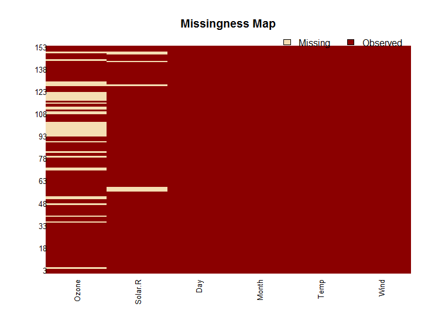

Special Charts
==========================

Missing Data Map
------------------------

While doing exploratory data analysis, it is important to identify variables which have a lot of missing data.

Let's see the variation of missing data in air quality dataset::

    > sapply(airquality, function(x){sum(is.na(x))})
      Ozone Solar.R    Wind    Temp   Month     Day 
         37       7       0       0       0       0 

Amelia library provides a function to visualize this::

    > require(Amelia)
    > mismap(airquality)

