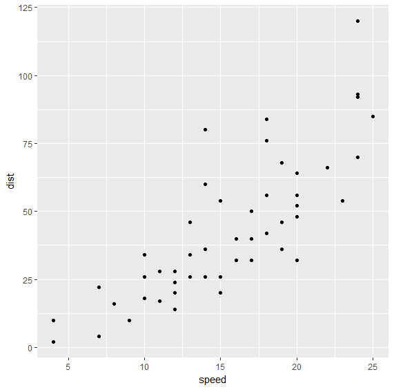
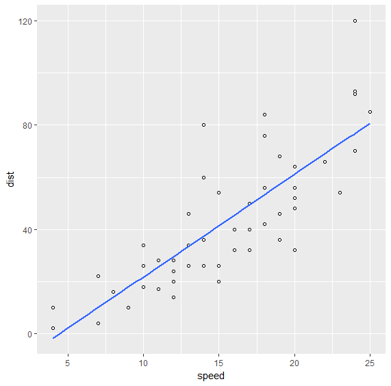
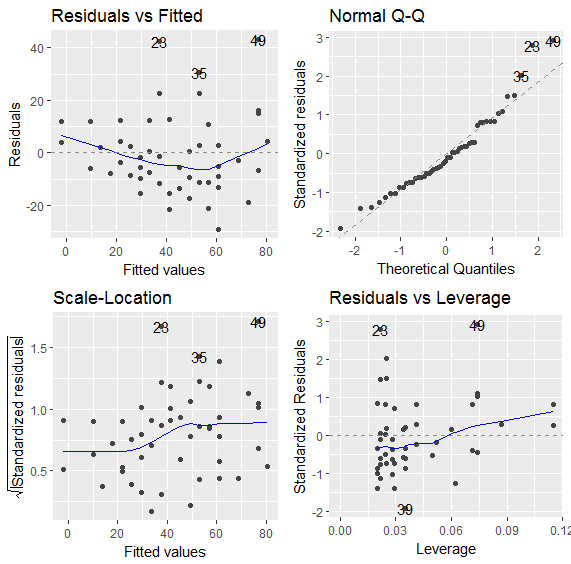

Linear Models
===================

.. index:: linear model, lm()

Cooked-up Examples
--------------------

We start with a simple linear model :math:`y = 2x`.  
We will generate some test samples containing pairs of (x,y) values.
Our goal would be to train a simple linear model :math:`y = w x`
with the test data and estimate the value of :math:`w`.

Let us prepare some test data::

    > x <- 1:10
    > y <- 2*x

Let us fit a model ``y~x`` meaning ``y`` is linearly dependent on ``x`` (with a possible bias term) as

.. math::

    y = w x + c

The goal of fitting the model is to compute the weight coefficient ``w`` and the intercept or
bias or offset term ``c``::

    > lmfit <- lm(y~x)

We can print the model::

    > lmfit

    Call:
    lm(formula = y ~ x)

    Coefficients:
    (Intercept)            x  
      2.247e-15    2.000e+00  

The coefficients can be extracted separately::

    > coefficients(lmfit)
     (Intercept)            x 
    2.246933e-15 2.000000e+00 

The fitted y values for every value of x::

    > fitted.values(lmfit)
     1  2  3  4  5  6  7  8  9 10 
     2  4  6  8 10 12 14 16 18 20 

This looks too good to be true. Let's add an intercept term and also introduce some noise::

    > n <- length(x)
    > e <- rnorm(n, sd = 0.1)
    > y <- 2*x + 3 + e

Fitting the linear mode::

    > lmfit <- lm(y~x)
    > lmfit

    Call:
    lm(formula = y ~ x)

    Coefficients:
    (Intercept)            x  
          2.933        2.008  

The intercept value is very close to 3 and the weight is also pretty close to 2.

Let's compare the fitted values with actual values of y::

    > fitted.values(lmfit)
            1         2         3         4         5         6         7         8         9 
     4.941002  6.949160  8.957318 10.965476 12.973634 14.981792 16.989951 18.998109 21.006267 
           10 
    23.014425 
    > y
     [1]  4.941495  6.895725  9.110955 10.874365 12.980755 14.998704 16.899220 19.066500
     [9] 20.932681 23.076735

We can also see the residual values::

    > residuals(lmfit)
                1             2             3             4             5             6 
     0.0004929328 -0.0534350207  0.1536365592 -0.0911108850  0.0071203406  0.0169111935 
                7             8             9            10 
    -0.0907301344  0.0683915230 -0.0735859540  0.0623094450 

Let's look at more complicated models.

A polynomial in x::

    > y <- 3 + 4*x + 5 *x^2 + rnorm(n, sd=0.1)
    > lmfit <- lm(y~1+x+I(x^2))
    > lmfit

    Call:
    lm(formula = y ~ 1 + x + I(x^2))

    Coefficients:
    (Intercept)            x       I(x^2)  
          2.945        3.965        5.005  

Multiple sinusoidal variables::

    > x <- sin(pi *seq(0, 2, by=0.05))
    > y <- cos(pi *seq(0, 2, by=0.05))
    > n <- length(x)
    > z <- 2 + 3*x + 4*y + rnorm(n, sd=0.1)
    > lmfit <- lm(z~x+y)
    > lmfit

    Call:
    lm(formula = z ~ x + y)

    Coefficients:
    (Intercept)            x            y  
          2.014        2.982        4.015  

With just 41 samples, the estimate is pretty good.

Fitting without the intercept term::

    > z <- 2 + 3*x + 4*y + rnorm(n, sd=0.1)
    > lm(z~0+x+y)

    Call:
    lm(formula = z ~ 0 + x + y)

    Coefficients:
        x      y  
    2.982  4.111  

We note that the original formula had an intercept term. This
had an undesired effect on the estimate of the weights of x and y.

Let us consider an example where the construction of z doesn't have an intercept term::

    > z <- 3*x + 4*y + rnorm(n, sd=0.1)
    > lmfit <- lm(z~0+x+y)
    > lmfit

    Call:
    lm(formula = z ~ 0 + x + y)

    Coefficients:
        x      y  
    3.003  3.984 
    > coefficients(lmfit)
           x        y 
    3.003388 3.983586 

We see that the weights of x and y are calculated correctly.

.. rubric:: Fitting on a data frame

Let's explore the relationship between the mpg and disp variables in the mtcars dataset.

Attaching the dataset::

    > attach(mtcars)

Exploring a polynomial dependency:: 

    > lmfit <- lm(disp~1+mpg+I(mpg^2))
    > lmfit

    Call:
    lm(formula = disp ~ 1 + mpg + I(mpg^2))

    Coefficients:
    (Intercept)          mpg     I(mpg^2)  
       941.2143     -53.0598       0.8101  

Measuring the quality of estimation as ratio between residuals and fitted values::

    > mean(abs(residuals(lmfit) / fitted.values(lmfit) ))
    [1] 0.1825118

Cars Data Set
--------------------

``cars`` dataset is shipped with R distribution. It captures the speed of
cars vs the distance taken to stop the car. This data was recorded in 1920s.
The data set consists of 50 records::

    > dim(cars)
    [1] 50  2

Summary statistics::

    > summary(cars)
         speed           dist       
     Min.   : 4.0   Min.   :  2.00  
     1st Qu.:12.0   1st Qu.: 26.00  
     Median :15.0   Median : 36.00  
     Mean   :15.4   Mean   : 42.98  
     3rd Qu.:19.0   3rd Qu.: 56.00  
     Max.   :25.0   Max.   :120.00  

Let us create a scatter plot of speed vs distance data::

    > qplot(speed, dist, data=cars)

There appears to be a good correlation between speed and distance 
and the relationship appears to be quite linear. Let us verify
the correlation between the two variables too::

    > cor(cars)
              speed      dist
    speed 1.0000000 0.8068949
    dist  0.8068949 1.0000000

Let us fit a linear model ``dist = a + b speed`` to this dataset::

    > fit <- lm(dist~speed, data=cars)
    > fit

    Call:
    lm(formula = dist ~ speed, data = cars)

    Coefficients:
    (Intercept)        speed  
        -17.579        3.932  

The fitted values for distance are::

    > round(fitted.values(fit), 2)
        1     2     3     4     5     6     7     8     9    10    11    12    13    14    15    16    17    18    19 
    -1.85 -1.85  9.95  9.95 13.88 17.81 21.74 21.74 21.74 25.68 25.68 29.61 29.61 29.61 29.61 33.54 33.54 33.54 33.54 
       20    21    22    23    24    25    26    27    28    29    30    31    32    33    34    35    36    37    38 
    37.47 37.47 37.47 37.47 41.41 41.41 41.41 45.34 45.34 49.27 49.27 49.27 53.20 53.20 53.20 53.20 57.14 57.14 57.14 
       39    40    41    42    43    44    45    46    47    48    49    50 
    61.07 61.07 61.07 61.07 61.07 68.93 72.87 76.80 76.80 76.80 76.80 80.73 

We can plot the fitted values as follows::

    > ggplot(data=cars, mapping=aes(x=speed, y=dist)) + geom_point(shape=1) + geom_smooth(method='lm', se=FALSE)

Diagnostics
''''''''''''''''''''''''

We can print the summary statistics for the linear model as follows::

    > fit.summary <- summary(fit); fit.summary

    Call:
    lm(formula = dist ~ speed, data = cars)

    Residuals:
        Min      1Q  Median      3Q     Max 
    -29.069  -9.525  -2.272   9.215  43.201 

    Coefficients:
                Estimate Std. Error t value Pr(>|t|)    
    (Intercept) -17.5791     6.7584  -2.601   0.0123 *  
    speed         3.9324     0.4155   9.464 1.49e-12 ***
    ---
    Signif. codes:  0 ‘***’ 0.001 ‘**’ 0.01 ‘*’ 0.05 ‘.’ 0.1 ‘ ’ 1

    Residual standard error: 15.38 on 48 degrees of freedom
    Multiple R-squared:  0.6511,    Adjusted R-squared:  0.6438 
    F-statistic: 89.57 on 1 and 48 DF,  p-value: 1.49e-12

Several important statistics can be separated out. 

R Squared:: 

    > fit.summary$r.squared
    [1] 0.6510794

Adjusted R Squared::

    > fit.summary$adj.r.squared
    [1] 0.6438102

F Statistic:: 

    > fit.summary$fstatistic
       value    numdf    dendf 
    89.56711  1.00000 48.00000 

The ``ggfortify`` library provides functions to let ggplot interpret linear models::

    > install.packages("ggfortify")
    > library(ggfortify)

We are now ready to plot the diagnostics for this model::

    > autoplot(fit)

Cats Data Set
------------------------

This data set is available in MASS package. The data set records
body weight and heart weight for 144 cats along with their sex.

Loading the dataset:: 

    > data(cats, package='MASS')

Variables in the data set::

    > str(cats)
    'data.frame':   144 obs. of  3 variables:
     $ Sex: Factor w/ 2 levels "F","M": 1 1 1 1 1 1 1 1 1 1 ...
     $ Bwt: num  2 2 2 2.1 2.1 2.1 2.1 2.1 2.1 2.1 ...
     $ Hwt: num  7 7.4 9.5 7.2 7.3 7.6 8.1 8.2 8.3 8.5 ...

Few rows from data set::

    > head(cats)
      Sex Bwt Hwt
    1   F 2.0 7.0
    2   F 2.0 7.4
    3   F 2.0 9.5
    4   F 2.1 7.2
    5   F 2.1 7.3
    6   F 2.1 7.6

Summary statistics::

    > summary(cats)
     Sex         Bwt             Hwt       
     F:47   Min.   :2.000   Min.   : 6.30  
     M:97   1st Qu.:2.300   1st Qu.: 8.95  
            Median :2.700   Median :10.10  
            Mean   :2.724   Mean   :10.63  
            3rd Qu.:3.025   3rd Qu.:12.12  
            Max.   :3.900   Max.   :20.50  

Predicting the heart weight from body weight::

    > fit <- lm(Hwt~Bwt, data=cats)
    > fit

    Call:
    lm(formula = Hwt ~ Bwt, data = cats)

    Coefficients:
    (Intercept)          Bwt  
        -0.3567       4.0341  

Summary statistics for the fitted model::

    > summary(fit)

    Call:
    lm(formula = Hwt ~ Bwt, data = cats)

    Residuals:
        Min      1Q  Median      3Q     Max 
    -3.5694 -0.9634 -0.0921  1.0426  5.1238 

    Coefficients:
                Estimate Std. Error t value Pr(>|t|)    
    (Intercept)  -0.3567     0.6923  -0.515    0.607    
    Bwt           4.0341     0.2503  16.119   <2e-16 ***
    ---
    Signif. codes:  0 ‘***’ 0.001 ‘**’ 0.01 ‘*’ 0.05 ‘.’ 0.1 ‘ ’ 1

    Residual standard error: 1.452 on 142 degrees of freedom
    Multiple R-squared:  0.6466,    Adjusted R-squared:  0.6441 
    F-statistic: 259.8 on 1 and 142 DF,  p-value: < 2.2e-16

The t-value for intercept term is small. This is indicative that if body weight is 0,
then heart weight will also be 0.

Let us check if including the sex of the cat provides any help in improving the model::

    > fit2 <- lm(Hwt~Bwt+Sex, data=cats)
    > fit2

    Call:
    lm(formula = Hwt ~ Bwt + Sex, data = cats)

    Coefficients:
    (Intercept)          Bwt         SexM  
        -0.4150       4.0758      -0.0821  

    > summary(fit2)

    Call:
    lm(formula = Hwt ~ Bwt + Sex, data = cats)

    Residuals:
        Min      1Q  Median      3Q     Max 
    -3.5833 -0.9700 -0.0948  1.0432  5.1016 

    Coefficients:
                Estimate Std. Error t value Pr(>|t|)    
    (Intercept)  -0.4149     0.7273  -0.571    0.569    
    Bwt           4.0758     0.2948  13.826   <2e-16 ***
    SexM         -0.0821     0.3040  -0.270    0.788    
    ---
    Signif. codes:  0 ‘***’ 0.001 ‘**’ 0.01 ‘*’ 0.05 ‘.’ 0.1 ‘ ’ 1

    Residual standard error: 1.457 on 141 degrees of freedom
    Multiple R-squared:  0.6468,    Adjusted R-squared:  0.6418 
    F-statistic: 129.1 on 2 and 141 DF,  p-value: < 2.2e-16

We note that the residual standard error has increased and the F statistic has decreased.
We see that t-value for the sex parameter is very small. It doesn't add value to the model.
