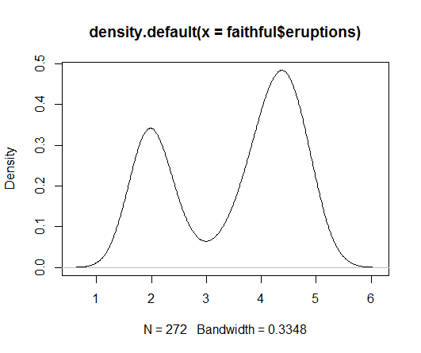
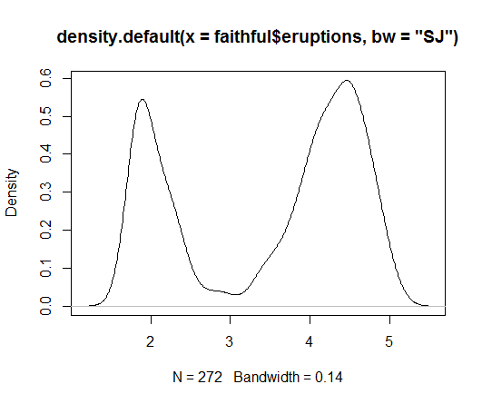

Kernel Density Estimation
======================================================================

.. index:: kernel density estimation, kde, bw

A kernel is a special type of probability density function (PDF) with the added property that it must be even.  Thus, a kernel is a function with the following properties

* real-valued
* non-negative
* even
* its definite integral over its support set must equal to 1

A bump is assigned to each data point. The size 
of the bump is proportional to the number of points
at that value. The estimated density function is the
average of bumps over all data points.

The density() function in R computes the values of the kernel density estimate. 

Let us estimate and plot the PDF of eruptions from faithful dataset::

    > plot(density(faithful$eruptions))

A more reliable approach for automatic estimation of bandwidth::

    > plot(density(faithful$eruptions, bw='SJ'))

