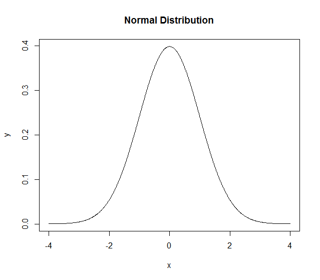

Normal Distribution
======================================================================

.. index:: normal distribution, gaussian distribution

The normal density function is given by

.. math::
    
    f_X(x) = \frac{1}{\sqrt{2\pi} \sigma} \exp\left ( - \frac{(x - \mu)^2}{2\sigma^2} \right)

.. index:: dnorm

.. rubric:: Probability Density Function

Evaluating the density function for different values of :math:`x`, :math:`\mu` and
:math:`\sigma`::

    > dnorm(x=0, mean = 0, sd = 1)
    [1] 0.3989423
    > dnorm(x=-4:4, mean = 0, sd = 1)
    [1] 0.0001338302 0.0044318484 0.0539909665 0.2419707245 0.3989422804 0.2419707245 0.0539909665 0.0044318484
    [9] 0.0001338302
    > dnorm(x=-3:5, mean = 1, sd = 1)
    [1] 0.0001338302 0.0044318484 0.0539909665 0.2419707245 0.3989422804 0.2419707245 0.0539909665 0.0044318484
    [9] 0.0001338302

We can use ``dnorm`` to plot the PDF of normal distribution::

    > x <- seq(-4,4,by=0.01)
    > y <- dnorm(x)
    > plot(x,y, 'l', main ='Normal Distribution')

.. index:: pnorm

.. rubric:: Cumulative Distribution Function

The function ``pnorm()`` is used to compute the CDF of normal distribution up to 
any point on the real line::

    > pnorm(0)
    [1] 0.5
    > pnorm(1)
    [1] 0.8413447
    > pnorm(-1)
    [1] 0.1586553
    > pnorm(1, mean=1)
    [1] 0.5
    > pnorm(-4:4)
    [1] 3.167124e-05 1.349898e-03 2.275013e-02 1.586553e-01 5.000000e-01 8.413447e-01 9.772499e-01 9.986501e-01
    [9] 9.999683e-01

By default ``pnorm`` gives the integral of the PDF from :math:``-\infty`` to ``q``.
It is also possible to compute the integral from ``q`` to :math:`\infty` using the
``lower.tail`` parameter::

    > pnorm(0, lower.tail = FALSE)
    [1] 0.5
    > pnorm(1, lower.tail = FALSE)
    [1] 0.1586553
    > pnorm(-1, lower.tail = FALSE)
    [1] 0.8413447

Note that ``pnorm(x) + pnorm(x, lower.tail=FALSE)=1``.

.. index:: qnorm

.. rubric:: Quantile or Inverse Cumulative Distribution Function 

We can use the ``qnorm`` function to compute the z-score for a given quantile value::

    > qnorm(c(0, .25, .5, .75, 1))
    [1]       -Inf -0.6744898  0.0000000  0.6744898        Inf
    > qnorm(.5, mean=1)
    [1] 1
    > qnorm(pnorm(-3:3))
    [1] -3 -2 -1  0  1  2  3

Finally, we use ``rnorm`` for generating random numbers from the normal distribution.

.. index:: hazard function 

.. rubric:: Hazard function

Hazard function is given by :math:`H(x) = - log (1 - F(x))`.

    

This can be computed as follows::

    > q =1
    > -log(pnorm(q, lower.tail = FALSE))
    [1] 1.841022

.. rubric:: Log likelihood

.. index:: log-likelihood

Log likelihood function is given by :math:`log (f(x))`.
    

This can be computed by:: 

    > dnorm(x, log=TRUE)
    [1] -0.9189385

Bivariate Normal Distribution
------------------------------------

In this section, we will look at different ways to generate samples from bivariate normal distribution.

Let our random variable be denoted as X = (X1, X2). Let the number of samples to be generated be N.

The simplest case is when both X1 and X2 are independent standard normal variables::

    > N <- 1000
    > set.seed(123)
    > samples <- matrix(rnorm(N*2), ncol=2)
    > colMeans(samples)
    [1] 0.01612787 0.04246525
    > cov(samples)
              [,1]      [,2]
    [1,] 0.9834589 0.0865909
    [2,] 0.0865909 1.0194419

The next case is when the two variables are independent but have different means::

    > mu1 <- 1
    > mu2 <- 2
    > samples <- cbind(rnorm(N, mean=mu1), rnorm(N, mean=mu2))
    > colMeans(samples)
    [1] 0.9798875 1.9908396
    > cov(samples)
               [,1]       [,2]
    [1,] 0.95718335 0.04908825
    [2,] 0.04908825 0.98476186

There is a function called ``mvrnorm`` in the ``MASS`` package which is very flexible::

    > mu1 <- 1
    > mu2 <- 2
    > mu <- c(mu1, mu2)
    > sd1 <- 2
    > sd2 <- 4
    > corr <- 0.6
    > Sigma <- matrix(c(sd1, corr, corr, sd2), nrow=2)
    > library(MASS)
    > N <- 10000
    > samples <- mvrnorm(N, mu=mu, Sigma=Sigma)
    > colMeans(samples)
    [1] 0.9976949 2.0208528
    > cov(samples)
              [,1]      [,2]
    [1,] 1.9889508 0.6005303
    [2,] 0.6005303 4.0516402

