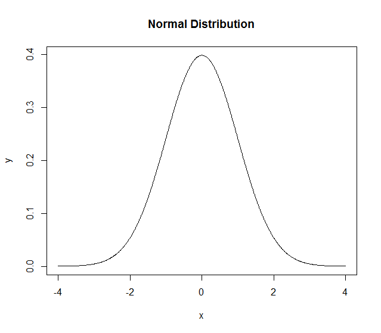
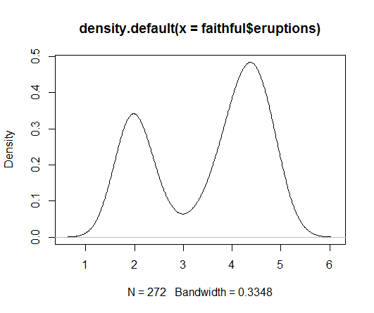
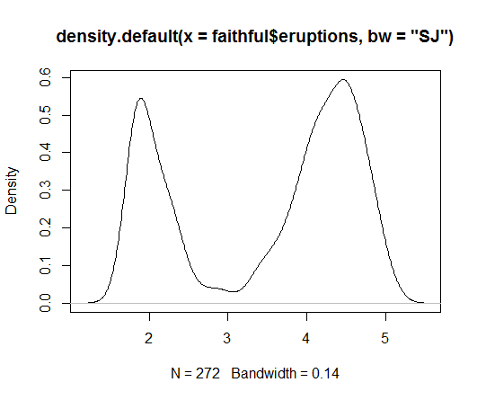

Probability
====================

Random Numbers
------------------

.. index:: rnorm, runif

Generate a vector of standard normal random numbers::

	rnorm(10)

A Gaussian random matrix::

	> matrix(rnorm(4*3), nrow=4, ncol=3)
	           [,1]       [,2]       [,3]
	[1,] -1.1436534  0.9533856 -0.6523511
	[2,] -1.6479827  2.4177261  0.4608755
	[3,] -0.5903960 -0.3371174  0.6652128
	[4,]  0.3527609 -0.5014484  0.2769601

Uniformly distributed numbers between 0 and 1::

	> runif(4)
	[1] 0.8272435 0.9034066 0.5614103 0.1499100

Uniformly distributed numbers between 1 and 4::

	> runif(4, min=1, max=4)
	[1] 1.788217 3.501510 2.996803 1.741222

.. index:: set.seed

Seeding the random number sequence::

	> set.seed(10)
	> rnorm(10)
	 [1]  0.01874617 -0.18425254 -1.37133055 -0.59916772  0.29454513  0.38979430 -1.20807618 -0.36367602
	 [9] -1.62667268 -0.25647839
	> rnorm(10)
	 [1]  1.10177950  0.75578151 -0.23823356  0.98744470  0.74139013  0.08934727 -0.95494386 -0.19515038
	 [9]  0.92552126  0.48297852
	> set.seed(10)
	> rnorm(10)
	 [1]  0.01874617 -0.18425254 -1.37133055 -0.59916772  0.29454513  0.38979430 -1.20807618 -0.36367602
	 [9] -1.62667268 -0.25647839
	> rnorm(10)
	 [1]  1.10177950  0.75578151 -0.23823356  0.98744470  0.74139013  0.08934727 -0.95494386 -0.19515038
	 [9]  0.92552126  0.48297852
	 

Coin Tossing
------------------------

Bernoulli trials can be generated from the binomial distribution.
Here is a way to generate a sequence of trials::

	> rbinom(10, size=1, prob=0.5)
	 [1] 0 1 0 1 1 1 0 0 1 1

We can use ``table`` to verify the distribution of 0s and 1s::

	> table(rbinom(1000, size=1, prob=0.5))

	  0   1 
	513 487 

Varying the probability of 1 has the desired impact::

	> table(rbinom(1000, size=1, prob=0.4))

	  0   1 
	629 371 

Sampling Data
-----------------------

.. index:: sample

The population from which samples will be created::

	> v = 1:10

Sample one value from a vector::

	> sample(v, 1)
	[1] 9
	> sample(v, 1)
	[1] 1
	> sample(v, 1)
	[1] 2
	> sample(v, 1)
	[1] 9

Sampling multiple values without replacement::

	> sample(v, 4)
	[1]  1  7 10  3
	> sample(v, 4)
	[1]  6 10  5  3
	> sample(v, 4)
	[1] 10  4  1  9
	> sample(v, 4)
	[1] 5 2 4 3

Sampling all values without replacement::

	> sample(v)
	 [1]  8 10  3  5  2  7  4  9  1  6
	> sample(v)
	 [1]  6  7  1 10  4  5  3  9  2  8

This is essentially a random permutation of the original vector.

Sampling with replacement::

	> sample(v, replace=TRUE)
	 [1]  5  1  5  5  3  7  9 10  5  6
	> sample(v, replace=TRUE)
	 [1]  4  3 10  9 10  9  6  8  6  3

Notice that some values are repeating and some values are missing.

We can sample as many values as we want with replacement::

	> sample(v, 20, replace=TRUE)
	 [1]  8  6  1  8  7 10  4  4  2  2  9  5  9  7  7  6  1  3  9  6

Probability Distributions
-------------------------------

Functions for several probability distributions are provided as part of R.
Some distribution are available in the global space. Additional distributions
are available through some packages.  

Each distribution has a name in R (e.g. norm, beta, t, f, etc.). 
For each distribution following functions are provided:

* Probability Density (Mass) Function (dnorm, dbeta, dt, df, etc.)
* Cumulative Distribution Function (pnorm, pbeta, , pt, pf, etc.)
* Quantile or Inverse Cumulative Distribution Function (qnorm, qbeta, qt, qf, etc.)
* Random Number Generator for the given distribution (rnorm, rbeta, rt, rf, etc.)

.. list-table::
	:header-rows: 1

	* - Distribution	
	  - R name	
	  - Additional arguments
	* - beta	
	  - beta	
	  - shape1, shape2, ncp
	* - binomial	
	  - binom	
	  - size, prob
	* - Cauchy	
	  - cauchy	
	  - location, scale
	* - chi-squared	
	  - chisq	
	  - df, ncp
	* - exponential	
	  - exp	
	  - rate
	* - F	
	  - f	
	  - df1, df2, ncp
	* - gamma	
	  - gamma	
	  - shape, scale
	* - geometric	
	  - geom	
	  - prob
	* - hypergeometric	
	  - hyper	
	  - m, n, k
	* - log-normal	
	  - lnorm	
	  - meanlog, sdlog
	* - logistic	
	  - logis	
	  - location, scale
	* - negative binomial	
	  - nbinom	
	  - size, prob
	* - normal	
	  - norm	
	  - mean, sd
	* - Poisson	
	  - pois	
	  - lambda
	* - signed rank	
	  - signrank	
	  - n
	* - Student’s t	
	  - t	
	  - df, ncp
	* - uniform	
	  - unif	
	  - min, max
	* - Weibull	
	  - weibull	
	  - shape, scale
	* - Wilcoxon	
	  - wilcox	
	  - m, n

Normal Distribution
---------------------------

.. index:: normal distribution, gaussian distribution

The normal density function is given by

.. math::
	
	f_X(x) = \frac{1}{\sqrt{2\pi} \sigma} \exp\left ( - \frac{(x - \mu)^2}{2\sigma^2} \right)

.. index:: dnorm

.. rubric:: Probability Density Function

Evaluating the density function for different values of :math:`x`, :math:`\mu` and
:math:`\sigma`::

	> dnorm(x=0, mean = 0, sd = 1)
	[1] 0.3989423
	> dnorm(x=-4:4, mean = 0, sd = 1)
	[1] 0.0001338302 0.0044318484 0.0539909665 0.2419707245 0.3989422804 0.2419707245 0.0539909665 0.0044318484
	[9] 0.0001338302
	> dnorm(x=-3:5, mean = 1, sd = 1)
	[1] 0.0001338302 0.0044318484 0.0539909665 0.2419707245 0.3989422804 0.2419707245 0.0539909665 0.0044318484
	[9] 0.0001338302

We can use ``dnorm`` to plot the PDF of normal distribution::

	> x <- seq(-4,4,by=0.01)
	> y <- dnorm(x)
	> plot(x,y, 'l', main ='Normal Distribution')

.. index:: pnorm

.. rubric:: Cumulative Distribution Function

The function ``pnorm()`` is used to compute the CDF of normal distribution up to 
any point on the real line::

	> pnorm(0)
	[1] 0.5
	> pnorm(1)
	[1] 0.8413447
	> pnorm(-1)
	[1] 0.1586553
	> pnorm(1, mean=1)
	[1] 0.5
	> pnorm(-4:4)
	[1] 3.167124e-05 1.349898e-03 2.275013e-02 1.586553e-01 5.000000e-01 8.413447e-01 9.772499e-01 9.986501e-01
	[9] 9.999683e-01

By default ``pnorm`` gives the integral of the PDF from :math:``-\infty`` to ``q``.
It is also possible to compute the integral from ``q`` to :math:`\infty` using the
``lower.tail`` parameter::

	> pnorm(0, lower.tail = FALSE)
	[1] 0.5
	> pnorm(1, lower.tail = FALSE)
	[1] 0.1586553
	> pnorm(-1, lower.tail = FALSE)
	[1] 0.8413447

Note that ``pnorm(x) + pnorm(x, lower.tail=FALSE)=1``.

.. index:: qnorm

.. rubric:: Quantile or Inverse Cumulative Distribution Function 

We can use the ``qnorm`` function to compute the z-score for a given quantile value::

	> qnorm(c(0, .25, .5, .75, 1))
	[1]       -Inf -0.6744898  0.0000000  0.6744898        Inf
	> qnorm(.5, mean=1)
	[1] 1
	> qnorm(pnorm(-3:3))
	[1] -3 -2 -1  0  1  2  3

Finally, we use ``rnorm`` for generating random numbers from the normal distribution.

.. index:: hazard function 

.. rubric:: Hazard function

Hazard function is given by :math:`H(x) = - log (1 - F(x))`.

	

This can be computed as follows::

	> q =1
	> -log(pnorm(q, lower.tail = FALSE))
	[1] 1.841022

.. rubric:: Log likelihood

.. index:: log-likelihood

Log likelihood function is given by :math:`log (f(x))`.
	

This can be computed by:: 

	> dnorm(x, log=TRUE)
	[1] -0.9189385

Discrete Distribution
-------------------------------

Let us define our sample space::

	> sample.space <- c(1,2,3, 4)

Let us define the probability mass function over the sample space::

	> pmf <- c(0.25, 0.3, 0.35, 0.1)
	> sum(pmf)
	[1] 1

Let's draw some samples from this distribution::

	> sample(sample.space, size=10, replace=T, prob=pmf)
	 [1] 2 3 3 3 3 4 2 1 3 2

Let's tabulate them for large number of samples::

	> table(sample(sample.space, size=10000, replace=T, prob=pmf))

	   1    2    3    4 
	2578 3059 3383  980 

Let's verify their proportions::

	> prop.table(table(sample(sample.space, size=10000, replace=T, prob=pmf)))

	     1      2      3      4 
	0.2522 0.3029 0.3505 0.0944 

Note that this matches quite well with the original probability mass function.

Kernel Density Estimation
------------------------------------

.. index:: kernel density estimation, kde, bw

A kernel is a special type of probability density function (PDF) with the added property that it must be even.  Thus, a kernel is a function with the following properties

* real-valued
* non-negative
* even
* its definite integral over its support set must equal to 1

A bump is assigned to each data point. The size 
of the bump is proportional to the number of points
at that value. The estimated density function is the
average of bumps over all data points.

The density() function in R computes the values of the kernel density estimate. 

Let us estimate and plot the PDF of eruptions from faithful dataset::

	> plot(density(faithful$eruptions))

A more reliable approach for automatic estimation of bandwidth::

	> plot(density(faithful$eruptions, bw='SJ'))

